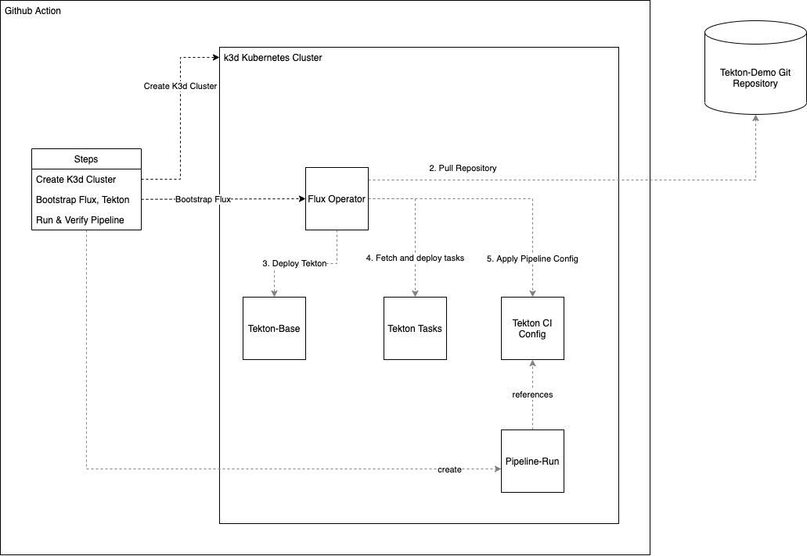

# Tekton CI Demo

This Demo repository will deploy and configure a Tekton CI System. The Project will automatically bootstrap a K3d cluster with Flux.



## Using the Tekton sample pipeline

You can inspect the deployed tasks and pipelines by issuing those commands. Before following along make sure to install the [CLI tools](https://tekton.dev/docs/getting-started/#set-up-the-cli).

```shell
tkn task list
tkn pipeline list
```

Create a pipeline run as follows and issue it via `kubectl create -f file.yaml` which will run the build pipeline.
````yaml
apiVersion: tekton.dev/v1beta1
kind: PipelineRun
metadata:
  generateName:  build-container-pipeline-
spec:
  pipelineRef:
    name:  build-container-pipeline
  workspaces:
    - name: build-workspace
      volumeClaimTemplate:
        spec:
          accessModes:
            - ReadWriteOnce
          resources:
            requests:
              storage: 50Mi

````

## Cluster Bootstrap

0. Setup a k3d repository

```sh
k3d registry create registry.localhost --port 5000
```

```sh
cd demo-apps
docker-compose build && docker-compose push
```

1. Make sure that you have kubectl and the [Flux
   CLI](https://toolkit.fluxcd.io/get-started/#install-the-flux-cli) installed
   locally. Also set your current kubectl context to the cluster you want to
   bootstrap.

2. Prepare a Github-Token that is able to access this repository and has the
   following scopes: `repo_status`, `public_repo`.

3. Choose a path inside this repository for the deployment manifests of the
   cluster. The different clusters are located in `clusters/`. This can either
   be an existing cluster or a new one. Flux will create folders for you if they
   do not exist.

4. Bootstrap the cluster with the information you have prepared in the previous
   steps:

   ```sh
   k3d cluster create --registry-use k3d-registry.localhost:5000
   ```

    ```sh
      GITHUB_USER=marcopaga GITHUB_TOKEN=<token> GITHUB_USER=marcopaga flux bootstrap github \
      --owner=marcopaga \
      --repository=tekton-demo \
      --private=false \
      --personal=true \
      --branch=main \
      --path=clusters/local
    ```
   
5. Check the progress of the deployment

```shell
kubectl get Kustomization -n flux-system -w
```

6. Connect to the Tekton Dashboard

The Dashboard is deployed and accessible via the `tekton-dashboard` service on port 9097.

```shell
kubectl --namespace tekton-pipelines port-forward svc/tekton-dashboard 9097:9097
```
