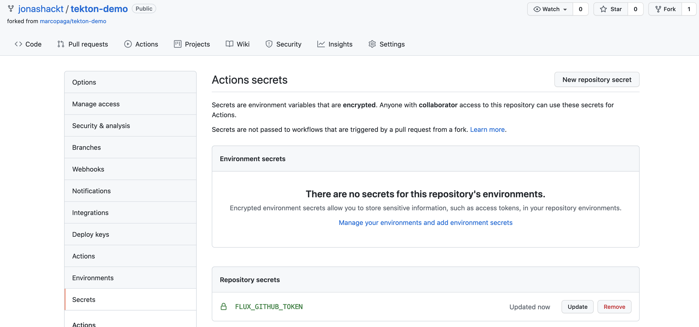

# Tekton CI Demo

This Demo repository will deploy and configure a Tekton CI System. The Project will automatically bootstrap a K3d cluster with Flux.


## CI of the Tekton CI

This repository uses GitHub Actions to validate the Tekton config. Every commit triggers a cluster creation and validation.
The up-to-date bootstrap process is documented in the GitHub Actions workflow you can find in [this repo](./.github/workflows/create-cluster.yml).

## Cluster Bootstrap

On a high level you need to provide a Github token with the following scopes: `repo_status`, `public_repo`. You can find the management dialog [here](https://github.com/settings/tokens). This token is used by the flux operator to connect to the git repository and roll-out the desired cluster state based on this repository.

#### 0. Create K3d registry (if you don't already have one):

```sh
k3d registry create registry.localhost --port 5000
```


#### 2. Create K3d cluster that uses the registry, incl. Tekton services and config:

```sh
k3d cluster create --registry-use k3d-registry.localhost:5000
```

This might take some time.

#### 3. Switch kubectl to K3d context & inspect cluster-info

```shell
kubectl config use-context k3d-k3s-default
kubectl cluster-info
```

#### 4. Install Flux components with flux bootstrap:

 ```sh
   GITHUB_TOKEN=<token> flux bootstrap github \
   --owner=<username-of-the-repo-owner> \
   --repository=tekton-demo \
   --private=false \
   --personal=true \
   --branch=main \
   --path=clusters/local
 ```
   
#### 5. Check the progress of the deployment

First wait for the Flux CRD deployment

```shell
kubectl -n default wait --for condition=established --timeout=180s crd/kustomizations.kustomize.toolkit.fluxcd.io
```

Now wait for the Kustomizations to be ready:

```shell
kubectl -n flux-system wait --for=condition=READY=True --timeout=60s kustomizations.kustomize.toolkit.fluxcd.io/flux-system \
kustomizations.kustomize.toolkit.fluxcd.io/tekton-base \
kustomizations.kustomize.toolkit.fluxcd.io/tekton-tasks \
kustomizations.kustomize.toolkit.fluxcd.io/tekton-ci-config
```


#### 6.(optional) Connect to the Tekton Dashboard

The Dashboard is deployed and accessible via the `tekton-dashboard` service on port 9097.

```shell
kubectl --namespace tekton-pipelines port-forward svc/tekton-dashboard 9097:9097
```

## Using the Tekton sample pipeline

You can inspect the deployed tasks and pipelines by issuing those commands. Before following along make sure to install the [CLI tools](https://tekton.dev/docs/getting-started/#set-up-the-cli).

```shell
tkn task list
tkn pipeline list
```

Create a pipeline run as follows and issue it via `kubectl create -f hello-goodbye-pipeline-run.yaml`. This command will return the created pipelinerun which you need for reference later. E.g. enter `tkn pr logs $PIPELINE_RUN_NAME` to get the log output of the pipeline.


# Using the repo yourself

For now in order to run all commands locally you need to fork the repository (otherwise the flux bootstrap doesn't work, since it will not have enough permissions - see https://github.com/marcopaga/tekton-demo/issues/11).

After forking, create a GitHub repository secret called `FLUX_GITHUB_TOKEN` containing your PAT (you need to create one as stated above):



Also remember to actively activate GitHub Actions for your fork.